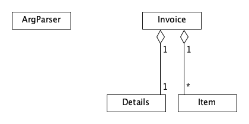
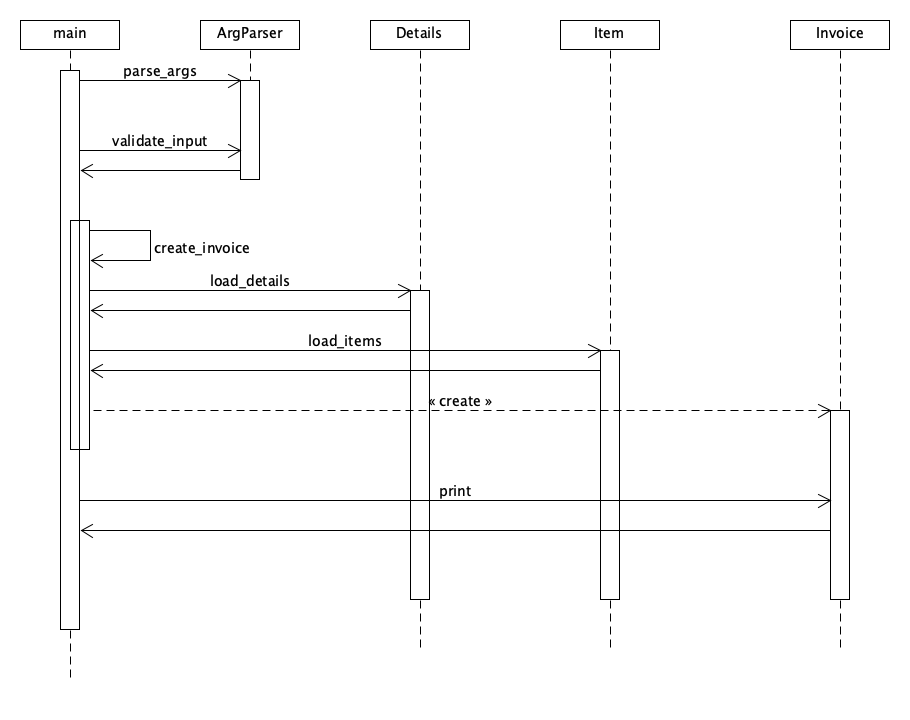

# Invoicer
A simple invoice generator

## Video Demo
https://youtu.be/mDrumOrSwkg

## Description
This program generates invoices in Portable Document Format (PDF).  It uses three, user-supplied, sources of information to be rendered in the contents of the generated document.

## Usage
```
python project.py -l [logo_image] -d <details.json> -i <items.csv>
```
where:
- _logo_image_ --> path to optional company logo image
- _details.json_ --> path to json file with invoice details
- _items.csv_ --> path to csv file with line items to be included in the invoice

### User Inputs
The contents of the generated invoice originate from three files supplied via command-line arguments.  These files are:

1. **A logo image**: this is an optional image (either png or jpeg formats), that will be used as part of the invoice header;
2. **Invoice details**: this is a json file, containing all the necessary information describing the details of the invoice.  It follows the following format:

```
{
  "company" : {
    "name" : "Mario's Plumbing Co",
    "street" : "Mario Bros. House",
    "city" : "Toad Town",
    "state" : "Mushroom Kingdom",
    "zip_code" : 12345,
    "phone" : "416-981-2455",
    "email" : "mario@mariosplumbco.com"
  },
  "customer" : {
    "name" : "Bowser",
    "street": "Royal Dungeon",
    "city" : "Bowser's Castle",
    "state" : "Koopa Kingdom",
    "zip_code" : 67890
  },
  "invoice" : {
    "number" : 25,
    "date" : "2024-03-04",
    "period_start" : "2024-02-01",
    "period_end" : "2024-02-29",
    "description" : "Plumbing services",
    "unit_cost" : 100,
    "terms" : 15,
    "tax_label" : "Sales Tax",
    "tax_rate" : 0.13
  }
}
```
The _company_ section provides the name and contact information of the service provider (aka the "invoicer") issuing the invoice.  The _customer_ section supplies information associated with the "invoicee" - the party responsible for paying the invoice.  The _invoice_ section supplies the following information:

+ _number_ - an alphanumeric sequence uniquely identifying the invoice
+ _date_ - ISO format date (YYYY-mm-dd) when the invoice is issued to the customer
+ _period_start_ - ISO format date (YYYY-mm-dd) when the services started
+ _period_end_ - ISO format date (YYYY-mm-dd) when the services ended
+ _description_ - a brief sentence summarizing what's being charged
+ _unit_cost_ - a floating point number representing the hourly rate charged for services
+ _terms_ - the maximum number of days the customer is allowed before paying the invoice
+ _tax_label_ - an optional textual label for the tax amount (if collected)
+ _tax_rate_ - an optional floating point number between 0 and 1, representing the percentage of tax to charge
 
3. **Items file**: this is a csv file specifying all the activities (line items) associated with the invoice.  It follows the format:

```
Date,Hours,Description
2024-02-02,5.0,"Fixed main pipeline on north side of castle"
2024-02-05,3.0,"Tested pipeline fixes, looked for leaks"
```
where:
+ _Date_ - ISO format date (YYYY-mm-dd) when the activity was performed
+ _Hours_ - a floating point number indicating the duration of the activity (in hours)
+ _Description_ - a short text describing the activity performed

## Design

All the logic necessary to validate inputs, format data and generate the invoice is defined inside 4 classes:



### ArgParser
This is a convenience wrapper around the `argparser` package.  It performs command-line input checks, as well as some preliminary sanity checks, namely:

+ if a logo image is specified, it verifies that:
  - the file exists
  - that is a valid image in either png or jpeg format
+ ensures that the supplied details.json file exists
+ ensures that the supplied items.csv file exists

### Details
This class encapsulates the invoice details - its main objective is to load the information specified in the `details.json` file, and ensure all required attributes are present.  In addition, it validates that the `unit_cost` is a valid float number.

### Item
This class represents a single line item (ie activity) to be included in the invoice.  It loads all line items specified in the `items.csv` file, validtating that:

+ all three attributes (Date, Hours and Description) are present
+ the supplied date is specified in ISO format (YYYY-mm-dd)
+ the supplied number of hours is a valid float number

### Invoice
This is the primary abstraction of the project.  It aggregates the information contained in `Details` and a list of `Item`s.  Its main objective is to generate a PDF document rendering all the invoice information.  Thus, its main concern is to layout and format the information in a way that is amenable for PDF generation; more specifically, adhering to the `fpdf` package's API (after all, the `Invoice` class is a subclass of `FPDF`). 

The following diagram depicts the sequence of events that take place when the program is ran with valid inputs:



## Design Choices

Other ideas and alternative design choices were considered; these were not pursued in the interest of time and to keep complexity to a minimum.  Some of these choices included:

+ Allowing the user to specify one of two modes: _"compact"_ vs _"standard"_.  In compact mode, only the company name (issuer) and customer name (invoicee) are required, and sensible defaults are generated for the rest of the information (ie invoice number, date, period, etc), whereas in "standard" mode, all invoice information is required to be specified by the user.

+ Allowing the user to supply the information either up-front via command-line arguments, or interactively as the program is running. With the latter approach, the program would prompt the user following a specific workflow, giving the user the opportunity to enter the information when mistakes were made.

+ Different strategies were considered when collecting data from the user via command-line arguments.  For instance, these are different ways of modelling the input data:

  + Option 1:
    - a path to logo image
    - a single csv file containing all input data (invoice details + line items)

  + Option 2:
    - a single json file containing all required information (path to logo image, invoice details, line items)

  + Option 3:
    - a path to logo image
    - a json file containing company contact info
    - a json file containing customer contact info
    - a json file with invoice-specific details
    - a json file with line items

+ Adding the concept of "task types", with each task type having its own unit cost.  Thus, a line item would be associated with a specific task type, allowing line items to be charged at different rates.

## Potential Enhancements

These are some ideas that were considered but were not implemented, and could become future enhancements:

+ Producing a hash of the generated pdf invoice, to guarantee that the contents aren't modified.

+ Adding a regular expression to validate Zip Codes/Postal Code formats.

+ Adding a regular expression to validate phone numbers.

+ Adding a regular expression to validate company email address.

+ Adding ordinal variants to some dates (ie 1st, 2nd, 3rd) under the Detailed Timesheet header.

+ Placing generated invoices under a known directory, and using a count of existing invoice files to auto-generate the next invoice number.

+ Adding validation to all input dates under details (invoice date, period start and period end), to ensure they are in ISO date format (YYYY-mm-dd).

+ Adding an option to include a discount (amount or percentage) to be subtracted from the subtotal amount.

+ Adding an option to classify line items by categories (ie projects).

+ Breaking down the `Invoice` class into more granular components, extracting some of the logic into smaller classes (ie `Header`, `Footer`, `SummaryTable`, `ItemsTable`, etc.).

+ Extracting some of the unit tests within `test_project.py` into individual test files corresponding to the classes being tested (ie `test_details.py`, `test_items.py`, `test_inovice.py`).

